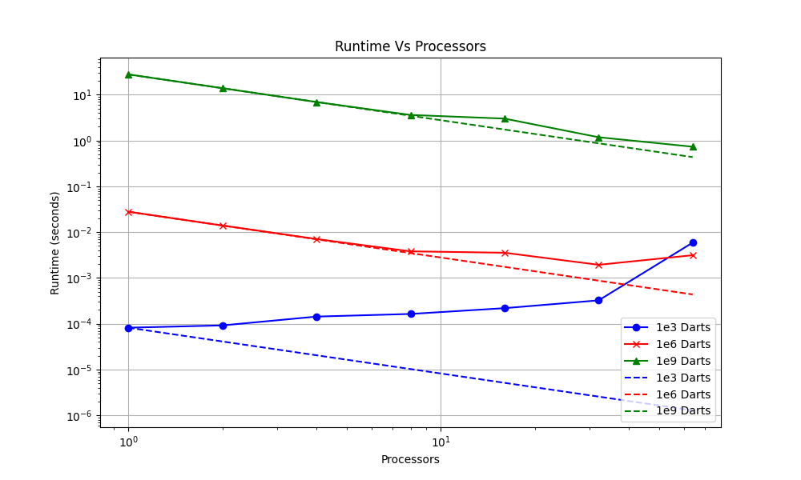

Warmup 
## Part 1
### 1.1 (Ex. 2.18)
While the serial initialization part sets all elements of a to zero without issue, the parallel update portion can lead to inefficient execution due to cache conflicts and cache misses as multiple threads simultaneously update different elements of the array a that may reside on the same cache line. This inefficiency reduces the overall performance of the parallel section.
### 1.2 (Ex. 2.19)
Using a chunksize of 1 in this context is a bad strategy because it leads to false sharing. False sharing occurs when multiple threads modify variables that are close enough in memory to reside on the same cache line, even if they are not actually sharing data. This results in inefficient use of the cache, as one thread's update invalidates the cache line for other threads, causing unnecessary cache misses and memory traffic. This pattern of distribution (0, t, 2t, ... to the first thread, 1, 1+t, 1+2t, ... to the second, etc.) exacerbates false sharing because consecutive iterations, which are likely to modify adjacent elements of `a[]`, are assigned to different threads, increasing the likelihood that these elements are on the same cache line.

A better chunksize would be larger than 1, ideally large enough to ensure that the work assigned to each thread covers a block of data that fits within a single cache line or spans multiple cache lines without overlap between threads. This reduces the risk of false sharing by aligning work with cache line boundaries and improving cache utilization. The optimal chunksize depends on the specific cache line size of the system and the nature of the calculation, but it should be chosen to minimize cross-thread cache line invalidation while maximizing the utilization of each thread.

### 1.3 (Ex. 2.21)
```c
// Global Version
for (i = 0; i < ProblemSize; i++) {
    if (i == 0)
        a[i] = (b[i] + b[i + 1]) / 2;
    else if (i == ProblemSize - 1)
        a[i] = (b[i] + b[i - 1]) / 2;
    else
        a[i] = (b[i] + b[i - 1] + b[i + 1]) / 3;
}

// Parallel Version with boundary fix
MPI_Comm_rank(MPI_COMM_WORLD, &myTaskID);
MPI_Comm_size(MPI_COMM_WORLD, &nTasks);
if (myTaskID == 0)
    leftproc = MPI_PROC_NULL;
else
    leftproc = myTaskID - 1;
if (myTaskID == nTasks - 1)
    rightproc = MPI_PROC_NULL;
else
    rightproc = myTaskID + 1;
MPI_Sendrecv(&b[LocalProblemSize - 1], &bfromleft, rightproc);
MPI_Sendrecv(&b[0], &bfromright, leftproc);
// get bfromleft and bfromright from neighbour processors, then
for (i = 0; i < LocalProblemSize; i++) {
    if (i == 0)
        bleft = bfromleft;
    else
        bleft = b[i - 1];
    if (i == LocalProblemSize - 1)
        bright = bfromright;
    else
        bright = b[i + 1];
    // handle if we are first operation
    if (myTaskID == 0 && i == 0) {
        a[i] = (b[i] + bright) / 2;
    }
    // handle if we are the very last operation
    else if (myTaskID == nTasks && i == LocalProblemSize - 1) {
        a[i] = (b[i] + bleft) / 2;
    } else {
        a[i] = (b[i] + bleft + bright) / 3;
    }
}
```
### 1.4 (Ex. 2.22)

Equation 2.5
$
\begin{cases}
y_i ← y_i + x_{i−1} & i = 1 . . . n − 1 \\
y_0 ← y_0 + x_{n−1} & i = 0
\end{cases}
$

```c
int main(int argc, char *argv[])
{
	MPI_INIT(&argc, &argv);
	int x, y = array elements of x[rank] and y[rank];
	int myTaskID, nTasks;
	MPI_Comm_rank(MPI_COMM_WORLD, &myTaskID);
	MPI_Comm_size(MPI_COMM_WORLD, &nTasks);

	// Send out x value to my right neighbor, as long as I'm not the last processor.
	if(myTaskId != nTasks-1){
    	MPI_ISend(x[myTaskId], 1, MPI_INT, myTaskID+1, 0, MPI_COMM_WORLD, &sendhandle);
	}
    

	//check what process number I am
	int recieved = 0;
	if(myTaskId == 0){
    	// I am first process, recieve from last processor
    	MPI_IReceive(recieved, 1, MPI_INT, nTasks-1, 0, MPI_COMM_WORLD, &recvhandle);
	}
	else {
    	// I am not the first, recieve from left processor
    	MPI_IReceive(recieved, 1, MPI_INT, nTasks-1, 0, MPI_COMM_WORLD, &recvhandle);
	}
	MPI_Wait(recvhandle);

	//Do work with recieved value.
	y[myTaskId] = y[myTaskId] + recieved;

    
	MPI_Wait(sendhandle);
	MPI_FINALIZE();
}

```
The disadvantage of this code compared to the blocking code is that it has more overhead  in managing the MPI requests.  Manually managing the completion of the sending and receiving operations also leads to increased complexity with synchronization.  We need to make sure to wait for the communication to be completed before manipulating the y value as the processes simply move on after starting their send or receive operation.  A blocking solution does not have such an issue.


### 1.5 (Ex. 2.23)
Considering that we have a communication between two nodes with bandwidth that only allows for one message to pass, the hybrid model has a performance increase in terms of bandwidth compared to the purely distributed model.  This is because the hybrid model is able to bundle messages together in one message.  The hybrid model also has lower latency compared to the purely distributed model as the hybrid model’s data can be shared through shared memory without having to go through the network.  Though, The hybrid model can run into issues with false sharing which will increase the latency. 


### 1.6 (Ex. 2.27)
In parallel computing, overlapping computation and communication can greatly enhance performance, depending on the specific tasks involved. Let's consider the potential gains in various scenarios:

When there's only communication and no computation time, the benefits of overlapping are limited since there's no computation to overlap with. However, it can still ensure efficient resource utilization by keeping processors busy during communication tasks.

On the other hand, if we are dealing with a situation with only computation and no communication, overlapping won't directly reduce overall execution time even though it helps maximize processor utilization by initiating communication tasks during computational downtime.

In real-world scenarios we are generally in the situation where both computation and communication occur, overlapping becomes crucial. By executing these tasks concurrently, idle periods are minimized, leading to faster overall execution times. The degree of benefit depends on factors such as communication efficiency, task parallelism, and the ability to overlap tasks without introducing overhead.

## Part 2

We followed the instructions of part 2 and setup the hpcc.

## Part 3
The code for this section is in part3 of hello.cpp. Initially, when compiled with g++ and executed normally, "Hello World!" was printed once. However, running it with mpiexec -n 4 printed "Hello World!" four times, as expected.

We then integrated MPI functionality by including #include "mpi.h", MPI_Initialize, and MPI_Finalize, along with output statements. After compiling with mpiCC, running with mpiexec using four processes resulted in clear outputs: "before init" printed four times, "Hello World! (after init before finalize)" printed four times, and "after finalize" printed four times. This clear separation occurred because MPI_Initialize and MPI_Finalize create a barrier, ensuring all processes reach a specific point before progressing further.

The exercises for part 3 are shown below, but they are also present in the repository as Q3_2.3.cpp, Q3_2.4.cpp, and Q3_2.5.cpp.

### Exercise 2.3
```c
#include "mpi.h"
#include <cstdio>
using namespace std;


int main(int argc, char *argv[]) 
{
    MPI_Init(&argc, &argv);
    
    int name_lenght = MPI_MAX_PROCESSOR_NAME;
    char process_name[name_lenght];
    MPI_Get_processor_name(process_name, &name_lenght);
    printf("Proc Name: %s\n", process_name);    
    

    MPI_Finalize();
    return 0;
}

```
### Exercise 2.4

```c
#include "mpi.h"
#include <cstdio>
using namespace std;


int main(int argc, char *argv[]) 
{
    MPI_Init(&argc, &argv);

    int size, rank;

    MPI_Comm_size(MPI_COMM_WORLD, &size);
    MPI_Comm_rank(MPI_COMM_WORLD, &rank);

    printf("Process: %d out of %d\n", rank, size);

    MPI_Finalize();
    return 0;
}
```

### Exercise 2.5
```c
#include "mpi.h"
#include <cstdio>
using namespace std;


int main(int argc, char *argv[]) 
{
    MPI_Init(&argc, &argv);

    int size, rank;

    MPI_Comm_size(MPI_COMM_WORLD, &size);
    MPI_Comm_rank(MPI_COMM_WORLD, &rank);
    
    if (rank == 0) {
       printf("Process: %d out of %d\n", rank, size);
    }
    MPI_Finalize();
    return 0;
}
```

# Part 4

## 4.1

We have extended ser_pi_calc.cpp in parallel_pi_calc.cpp, see that in the main directory. To test, "mpic++ parallel_pi_calc.cpp -o pi.out" to compile, "mpiexec -n {# Tasks} ./pi.out {# rounds} {# darts}".

## 4.2

Here are the results from running our parallel program on Thad's desktop using 1-4 ranks, each using 100 rounds and 10000 darts (1e6 total darts). Note, it evenly split the rounds as best as possible (for example, 3 ranks and 10 rounds would result in a split of 4,3,3 between them).


## 4.3

Discussed this with the professor in class, he said what was done in 4.2 was sufficient to cover this.

## 4.4

The batch job used to test ranks 1-64 can be found in submitjob.sb. It was specifically tested on one node.

## 4.5

The results here were specifically from testing on one single node. First, here is error vs processor count for 1e3 darts (blue), 1e6 darts (red), and 1e9 darts (green). Keep in mind it is log scaled on the both x-axis and y-axis.


As can be seen, the more darts used, the more accurate the result is compared to pi. While the result at 8 processors for 1e3 darts is an outlier, this can be attributed to a lucky chance with few darts. The more darts there were, the smoother the curve / less variance there typically was. These results match what is to be expected. The rate of convergence depending as a variable of dart count appears to be linear (as in, 1000 times more darts is about 10 times less error, which does make sense. Its hard to tell the exact convergence rate with only three points, but it is definitely the case that more darts means reduced error. As for the processor count, this doesn't relate to the convergence and it shouldn't, as the total number of darts remains the same for each processor count.

## 4.6

Now let us look at runtime vs processors, with the same color scheme for dart counts as before. 


As expected, the more darts, the longer it takes in general. Note, 1e9 darts (green) behaves as expected, getting faster the more processors there are, 1e6 starts getting slower after 32, and 1e3 gets slower after the 1. We predict this is due to the dart counts being small enough such that the overhead from setting up / communicating with other ranks is greater than just doing the calculation serially. In fact, 1e3 (blue) ends up reaching the same time as 1e6 at 64 ranks, likely because it is measuring the latency between communication/setup at that time for both.

This next figure is the same as before, but with "ideal" scalings added for each line.



Notice how for under 10 processors, both 1e6 and 1e9 follow near perfectly, and then they still keep close after that. As such, for higher dart counts and low processor counts, scaling is ideal. As for low dart counts, the scaling is awful as it actuall tends in the other direction, likely due to overhead outweighing the cost of doing it serially.

Finally, let's look at the efficiency of these using the same color scheme for dart counts as before.


As can be seen, 1e3 darts (blue) loses efficiency constantly from the start as processor count increases. On the other hand, both 1e6 and 1e9 retain parallel efficiency closer to one for longer, both starting to fall around 16 processors. While they broth drop near the same time, 1e9 (green) doesn't fall quite as far, which is expected. As for why the parallel efficiency varies with dart count, it is likely do to the fact that eventually the overhead and latency from more processors ends up utilizing more resources than it would take to do the calculation with less processors.

## 4.7

Here are the error and runtime results for testing on 5 nodes versus the single node results from before.


As can be seen, there is little difference in errors. On the other hand, the runtimes are mostly the same for 1e9 darts while 1e6 flattens out earlier and 1e3 increases faster and sooner before leveling out with 1e6. We predict that this is due to the smaller dart counts reaching the latency/overhead limit sooner as the communication cost is likely limiting them from becoming any faster at that point.
